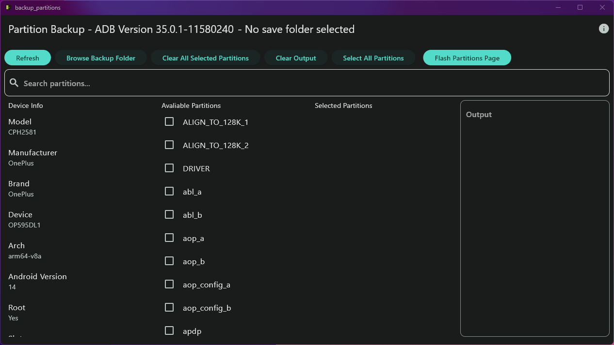

# Backup Android App

This is a flutter app that enables you to back up your android partitions using root and dd.
Please have adb installed globally on your computer. (`adb` should be in your PATH)
## Features

- Backup partitions
- Clean UI

## Screenshots



## How to use

- Install the app
- Grant root access to `com.android.shell`
- Ensure developer options is enabled with USB debugging
- Connect your phone to your computer
- Open the app
- Press refresh to see the partitions
- Select the partition you want to backup
- Select a location to save the backup
- Click on the backup button
- Wait for the backup to complete
- Done

## How to build

- Clone the repository
- `flutter pub get`
- `flutter build windows`

## License

MIT

```
Copyright 2024 Andy Wang

Permission is hereby granted, free of charge, to any person obtaining a copy of this software and associated documentation files (the “Software”), to deal in the Software without restriction, including without limitation the rights to use, copy, modify, merge, publish, distribute, sublicense, and/or sell copies of the Software, and to permit persons to whom the Software is furnished to do so, subject to the following conditions:

The above copyright notice and this permission notice shall be included in all copies or substantial portions of the Software.

THE SOFTWARE IS PROVIDED “AS IS”, WITHOUT WARRANTY OF ANY KIND, EXPRESS OR IMPLIED, INCLUDING BUT NOT LIMITED TO THE WARRANTIES OF MERCHANTABILITY, FITNESS FOR A PARTICULAR PURPOSE AND NONINFRINGEMENT. IN NO EVENT SHALL THE AUTHORS OR COPYRIGHT HOLDERS BE LIABLE FOR ANY CLAIM, DAMAGES OR OTHER LIABILITY, WHETHER IN AN ACTION OF CONTRACT, TORT OR OTHERWISE, ARISING FROM, OUT OF OR IN CONNECTION WITH THE SOFTWARE OR THE USE OR OTHER DEALINGS IN THE SOFTWARE.
```